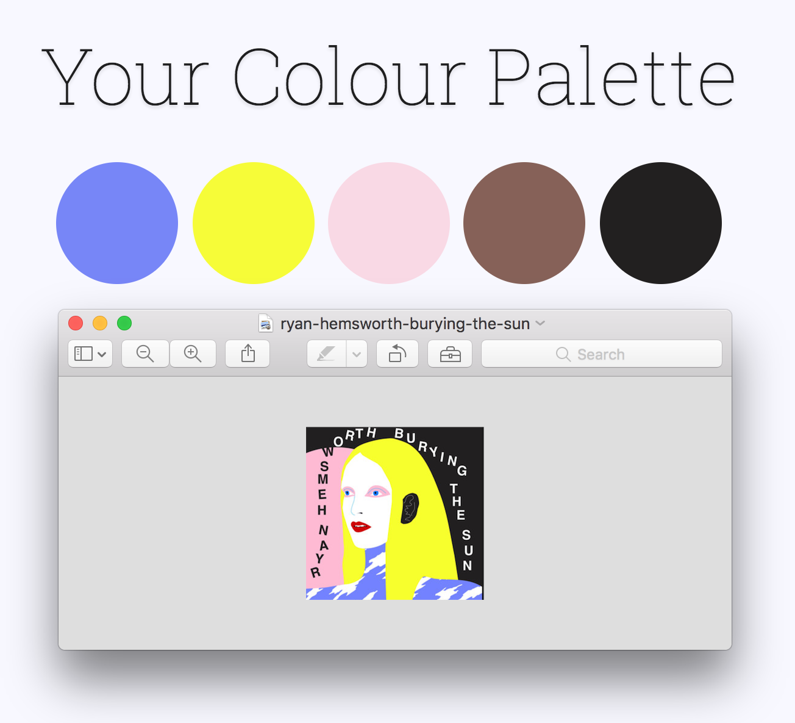
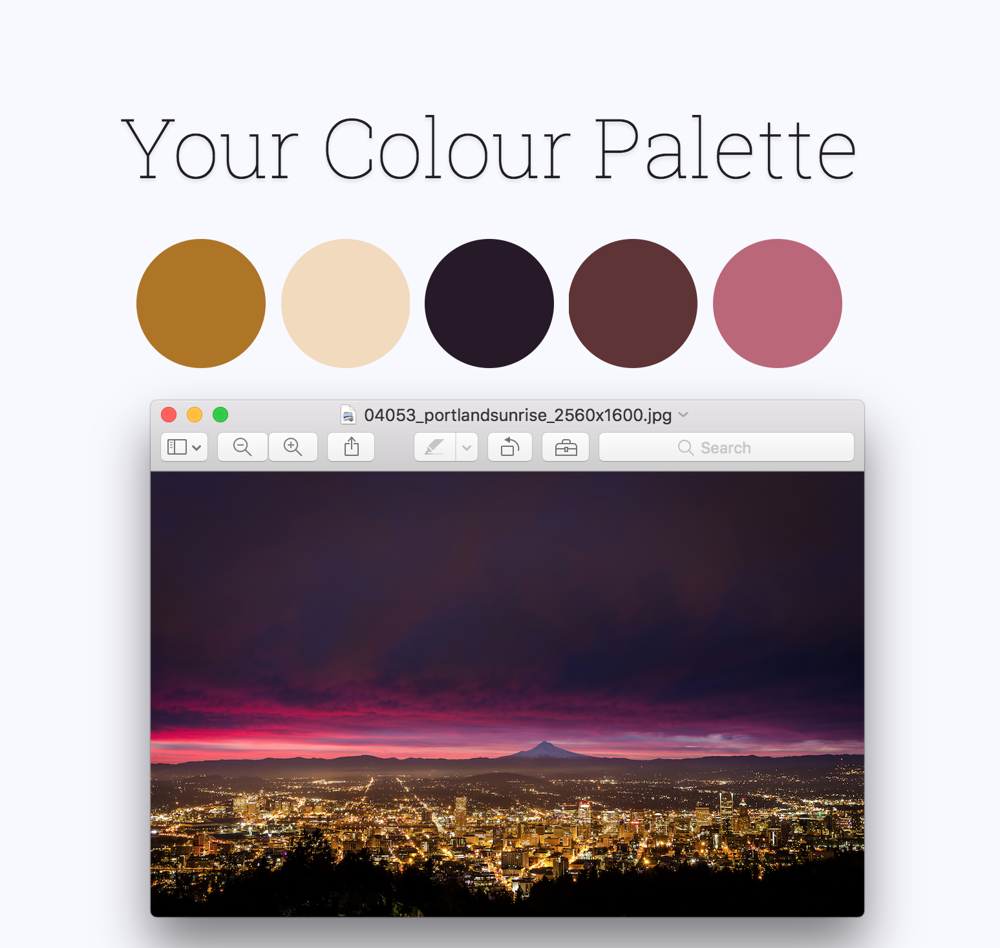

# Generate colour palettes from images.
### Just supply an image, and get a custom set of colours generated from the colours in the image.

Currently, *colour-palettes* uses a simple k-means clustering algorithm and calculates the mean colour of each cluster in order to produce a palette. This may change in the future as I tweak the algorithm and possibly introduce additional user controls.
